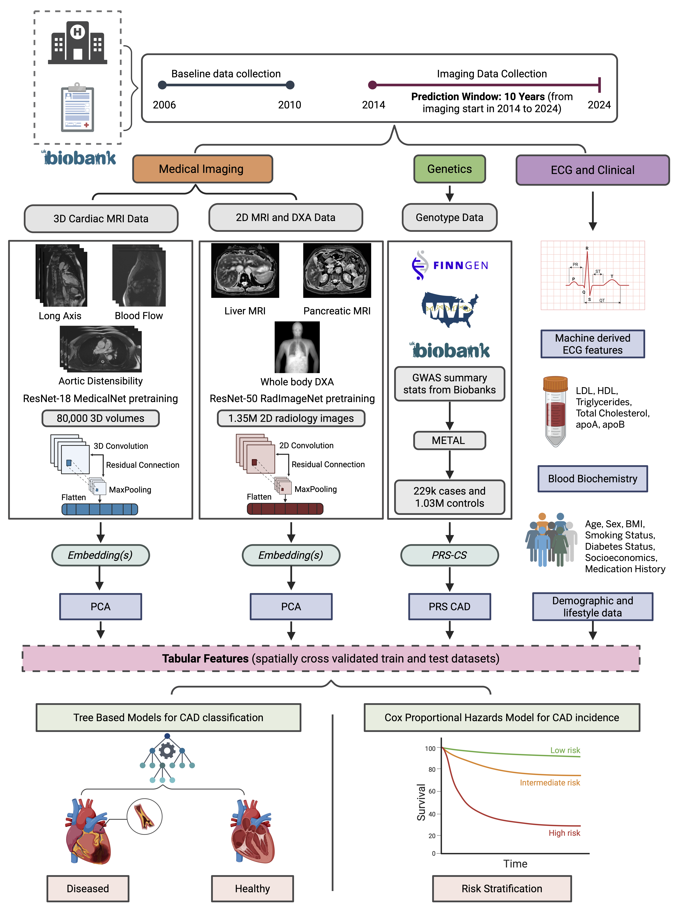

# preCog: Multimodal AI for Precision Cardiology

**preCog** is a comprehensive deep‐learning framework for predicting incident coronary artery disease (CAD) using multimodal data—cardiovascular MRI, liver & pancreatic MRI, DXA, ECG, and polygenic risk scores—developed by Devansh Pandey _et al._ and published in _XXX_.

---

## 🚀 Project Overview

- **Goal:** Leverage diverse data sources to improve 10-year CAD risk prediction beyond traditional scores (e.g., Framingham Risk Score and PREVENT equations).
- **Key Result:** preCog identfies a subgroup with a 15.8x incent CAD risk compared to Framigham Risk Score baseline by effectively using imaging and genetics on top of tradiational biomarkers.
- **Modalities:**
  - Cardiac MRI (3D cine long axis, aortic distesibility and blood flow)
  - Liver & Pancreas MRI
  - Full-body DXA
  - 12-lead ECG traces
  - Blood Biochemistry
  - Polygenic Risk Score (PRS)
  - Demogrpahic Data

---

